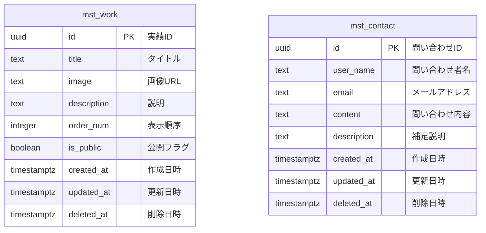
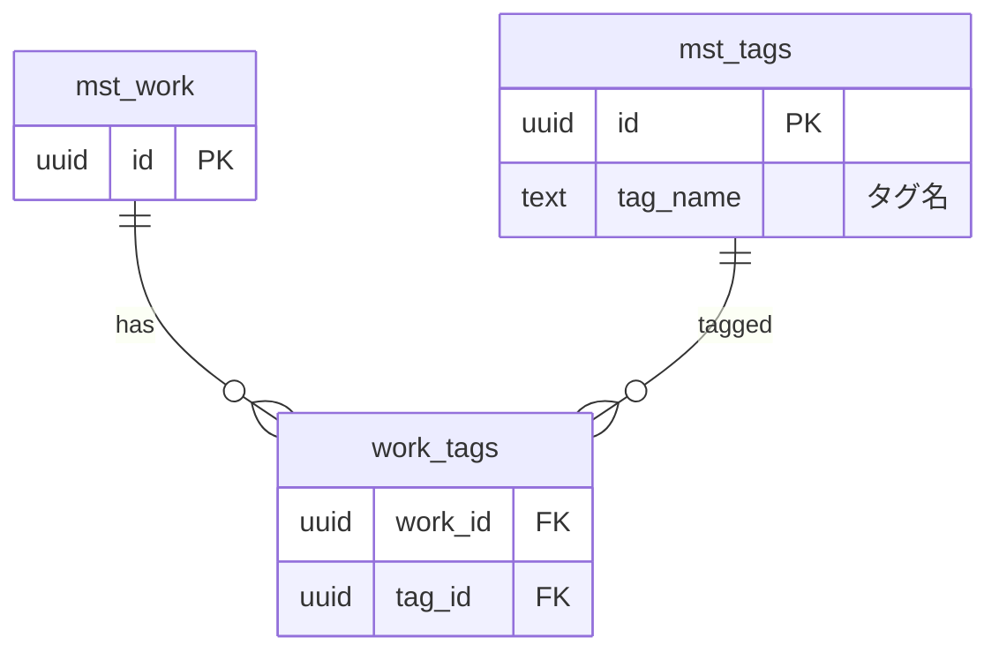

# ER図

## 概要
ポートフォリオサイトのデータベース構造を示すER図です。

## ER図 (Mermaid)



## テーブル説明

### mst_work (実績管理)
ポートフォリオとして表示する実績・作品を管理します。

**主な用途:**
- 公開する実績の一覧表示
- 実績詳細ページの表示
- 管理画面での実績の追加・編集・削除

**特記事項:**
- `is_public` で公開/非公開を制御
- `deleted_at` による論理削除
- 画像は Supabase Storage に保存し、URL を保持

### mst_contact (問い合わせ管理)
サイト訪問者からの問い合わせを管理します。

**主な用途:**
- 問い合わせフォームからの投稿受付
- SendGrid を使った自動返信メール送信
- 管理者への通知

**特記事項:**
- メールアドレスのバリデーション (CHECK制約)
- SendGrid との連携により、問い合わせ受付時に自動メール送信
- 将来的にステータス管理カラム追加予定

## リレーション

現在のバージョンでは、テーブル間にリレーションシップはありません。

### 今後の拡張案

将来的に以下のようなテーブルとリレーションの追加を検討:



**拡張候補:**
- タグ・カテゴリ機能 (`mst_tags`, `work_tags`)
- 問い合わせステータス管理 (`mst_contact_status`)
- 管理者アカウント (`mst_admin_users`)
- 問い合わせ返信履歴 (`mst_contact_replies`)

## データフロー

### 実績表示の流れ
```
1. ユーザーがポートフォリオページにアクセス
2. mst_work から is_public=true かつ deleted_at IS NULL のレコードを取得
3. order_num の昇順でソート(同じ場合は created_at の降順)
4. 画像は Supabase Storage から取得
```

### 問い合わせの流れ
```
1. ユーザーが問い合わせフォームを送信
2. mst_contact にレコード挿入
3. Supabase Edge Function がトリガー
4. SendGrid API を使って以下のメール送信:
   - ユーザーへの自動返信
   - 管理者への通知メール
```

## セキュリティ設計

### RLS (Row Level Security)

**mst_work:**
- SELECT: 公開されている実績 (`is_public=true AND deleted_at IS NULL`) は誰でも閲覧可能
- INSERT/UPDATE/DELETE: 将来的に管理者認証を実装予定

**mst_contact:**
- INSERT: 誰でも問い合わせ投稿可能
- SELECT: 管理者のみ閲覧可能 (将来実装)

### データ保護
- メールアドレスは CHECK 制約でフォーマット検証
- UUID を使用し、ID の推測を困難に
- 論理削除により誤削除からの復旧が可能